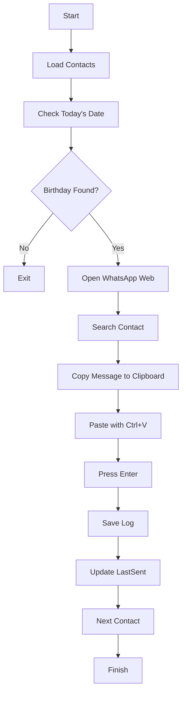
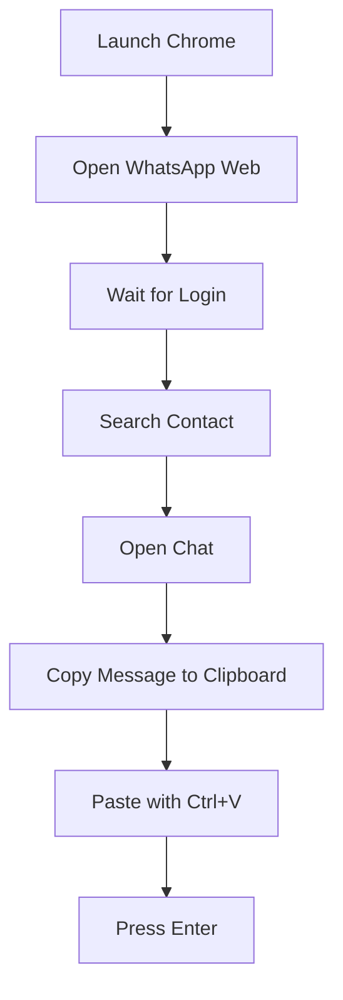

# Workflow

## Overall Program Flow

```mermaid
flowchart TD
    A[Start] --> B[Load Contacts]
    B --> C[Check Today's Date]
    C --> D{Birthday Found?}
    D -- No --> E[Exit]
    D -- Yes --> F[Open WhatsApp Web]
    F --> G[Search Contact]
    G --> H[Copy Message to Clipboard]
    H --> I2[Paste with Ctrl+V]
    I2 --> I[Press Enter]
    I --> J[Save Log]
    J --> K[Update LastSent]
    K --> L[Next Contact]
    L --> M[Finish]
```

## WhatsApp Automation Sub-flow

```mermaid
flowchart TD
    A[Launch Chrome] --> B[Open WhatsApp Web]
    B --> C[Wait for Login]
    C --> D[Search Contact]
    D[Search Contact] --> E[Open Chat]
	E --> F[Copy Message to Clipboard]
    F --> G2[Paste with Ctrl+V]
    G2 --> G[Press Enter]
```

## Related
- [[Modules]]
- [[Functional-Requirements]]
- [[Implementation-Phases]]
- [[00-Home|← Back to Home]]
